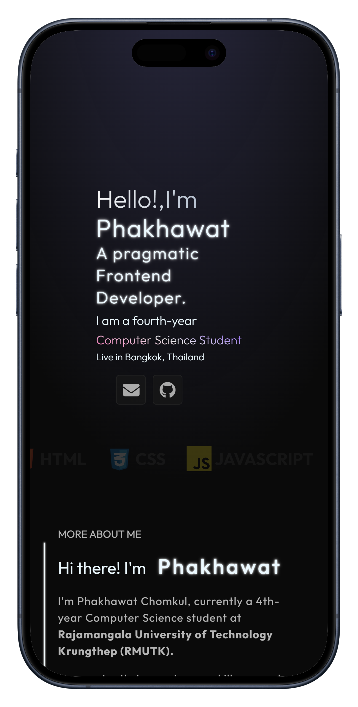
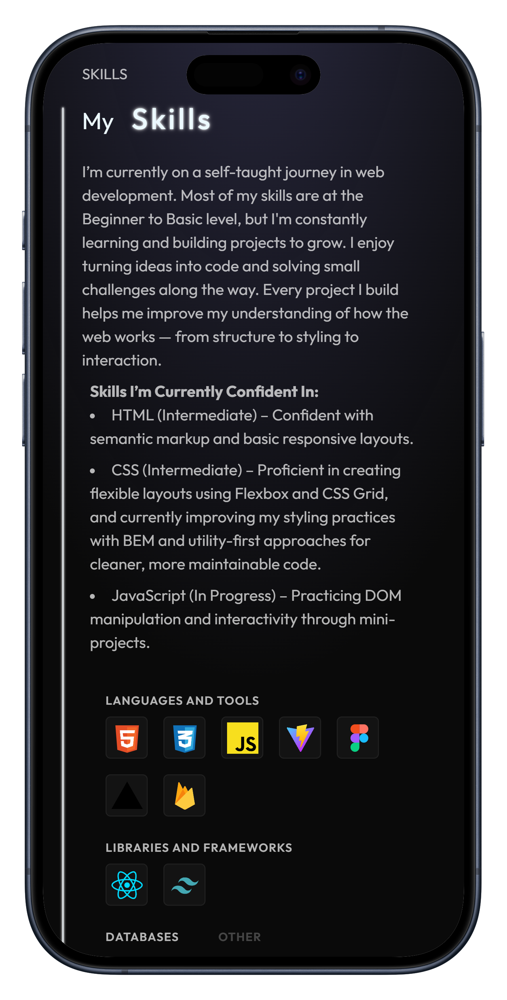
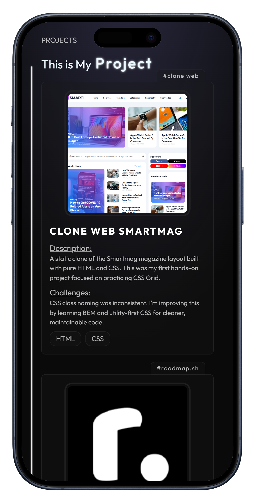
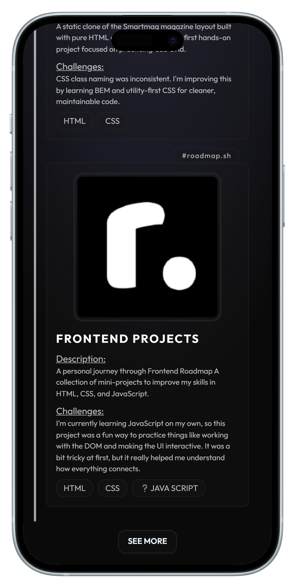

  <a href="#features">Features</a> •
  <a href="#demo">Demo</a> •
  <a href="#screenshots">Screenshots</a> •
  <a href="#tech-stack">Tech Stack</a>

This is my personal portfolio project, built using **React** and **Tailwind CSS**
It's my very first experience working with both technologies 

### ✨ Features:
- Built with React (Vite)
- Styled with Tailwind CSS
- Fully responsive layout
- Custom components and clean UI design

### 💡 Developer Note:
This project marks my first time working with React and Tailwind CSS  
While the code may not be perfect yet, I'm continuously learning and actively improving it

📌 **Note:** This is my first React project, self-learned from online resources and tutorials  
AI tools (e.g. ChatGPT) were used in less than 15% of the process — mainly for guidance and explanation

---

### 🚀 Live Demo:
[https://phakhawat.vercel.app](https://phakhawat.vercel.app)

---

## 💻 Tech Stack

<table align="center">
  <tr>
    <td align="center" width="96">
      
       React
    </td>
      <td align="center" width="96">
      
       Vite
    </td>
    <td align="center" width="96">
      
       Tailwind CSS
    </td>
    <td align="center" width="96">
      
       Vercel
    </td>
  </tr>
</table>

---

### 🙋 About Me
I'm passionate about front-end development and always eager to learn new tools and best practices.  
This portfolio is one of my first steps into the world of React development.

Feel free to explore the code and leave suggestions!

---

### 🖼️ Design Overview

#### 💻 Desktop

  
  
  

#### 📱 Responsive

  
  
  
  
  
  

